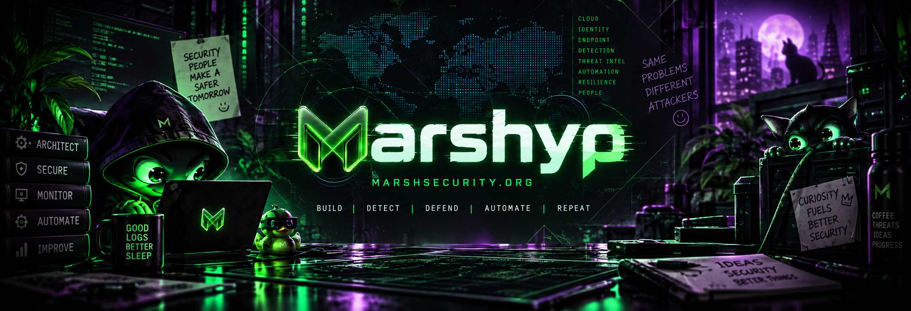
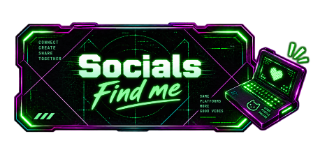

  
  

    
    
  

  
  <h1>
    Well hello there!
    
  </h1>

Cyber Security Engineer <code style="color: #1C8051">•</code> Security Architect <code style="color: #1C8051">•</code> Builder of Useful Things

  

 

 
  

Hi! I’m **Philip Marsh**, a Cyber Security Architect based in the UK, working in the legal sector.

My work focuses heavily on modern enterprise security, particularly across the Microsoft security ecosystem. I enjoy taking complex security problems, pulling them apart, understanding how they work, and building practical solutions that make security teams' lives easier, whilst understanding the business requirements. 

A lot of what I build, test, and write about centres around:

- 🛡️ Microsoft SIEM & XDR
- 🔎 Detection Engineering & Threat Hunting
- 💻 Endpoint Security
- ☁️ Microsoft Entra ID & Cloud Security
- ⚙️ Security Automation
- 📊 Security Architecture
- 🧰 PowerShell, KQL and security tooling
- 🧪 Testing, research and generally **buggin' things**

I’m particularly interested in making security tooling and guidance **practical, understandable and useful in the real world**.

  

 

  

I regularly publish practical security content covering Microsoft Security, enterprise architecture, detection engineering, automation and lessons learned from the field.

Here are some of my latest blog posts:

### 🌐 [MarshSecurity.org](https://marshsecurity.org)

<!-- BLOG-POST-LIST:START -->
- [Securing Windows for Home Users](https://marshsecurity.org/securing-windows-for-home-users/)
- [Protecting against a lost or stolen mobile](https://marshsecurity.org/protecting-against-lost-stolen-mobile-microsoft-security/)
- [Securing your Breakglass accounts](https://marshsecurity.org/securing-your-breakglass-accounts/)
- [Unpin Microsoft 365 Companion Apps via Intune](https://marshsecurity.org/unpin-microsoft-365-companion-apps-via-intune/)
<!-- BLOG-POST-LIST:END -->

 

  

You can find me around the internet here:

- 🌐 **Website:** [marshsecurity.org](https://marshsecurity.org)
- 💼 **LinkedIn:** [Philip Marsh](https://www.linkedin.com/marshsecurity)
- 🦋 **Bluesky:** [@marshsecurity.org](https://bsky.app/profile/marshsecurity.org)
- 💻 **GitHub:** [@Marshyp](https://github.com/Marshyp)

I’m always happy to talk security engineering, Sentinel, Defender, detection logic, architecture, tooling, automation or interesting security problems.

 

  

 

 

 

### 🛡️ Build. Detect. Defend. Automate. Improve.

**[MarshSecurity.org](https://marshsecurity.org)**

  

